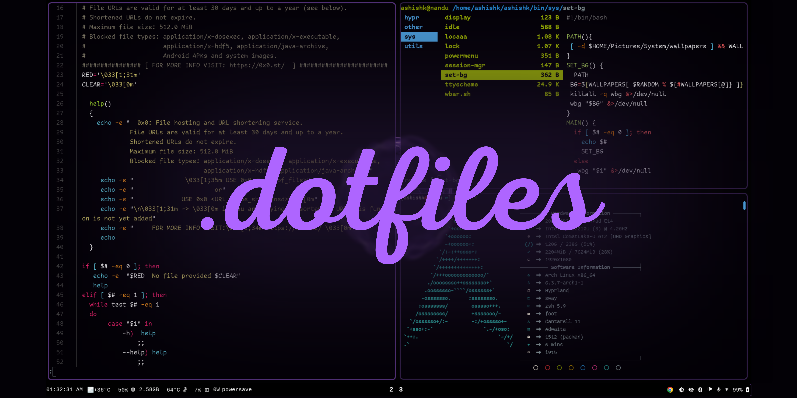

  

 
# Dotfile 
Welcome to my personal dotfiles repository! This collection of configuration files is tailored specifically to my preferences and workflow. Here's an overview of the dotfiles.

### Contents
*CLI configurations*: Includes dotfiles for command-line tools, such as shell configurations (e.g., .bashrc, .zshrv, starship, neofetch, lvim), aliases, environment variables, functions, and other CLI-specific settings.
    .bashrc - Configuration for the Bash shell.
    .bash_profile - Profile script executed for login shells in Bash.
    .zshrc - Configuration for the Zsh shell.
    .zprofile - Profile script executed for login shells in Zsh.
    .profile - Common profile script shared between Bash and Zsh.
    .aliases - Custom shell aliases for commonly used commands.
#### Application Launchers
    .rofi/config - Configuration for the Rofi application launcher.
#### System Information
    .neofetch/config.conf - Configuration for the Neofetch system information tool. 

Feel free to explore and use these dotfiles as a starting point for your own customizations. However, keep in mind that these configurations are highly tailored to my personal preferences and may not suit everyone's needs.

*GUI configurations*: Consists of dotfiles for graphical user interface applications, such as window managers, editors (e.g., Vim, Emacs), terminal emulators (e.g., foot, Alacritty), mako, onlyoffice, udiskie, rofi,and other GUI-related settings.

If you have any questions or suggestions, feel free to reach out. Happy customizing!
